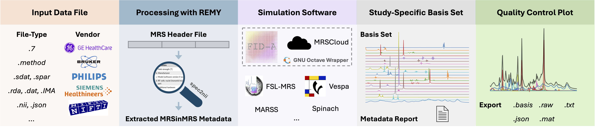

<div align="center">
  
  <h1 style="margin-top: 5px; margin-bottom: 5px;">BasisREMY</h1>
  <p style="margin-top: 0px;"><em>A Unified Framework for Study-Specific Basis Set Generation in MR Spectroscopy</em></p>
  
  [](https://www.python.org/)
  []()
  [](https://submissions.mirasmart.com/ISMRM2026/)
</div>

---

A tool for generating study-specific basis sets directly from raw MRS data, integrating real pulse shapes and acquisition parameters. This project is in its early development stages, and contributions, testing, and feedback are highly welcomed!

<div align="center">
  
</div>

---

## Prerequisites

For the recommended [`uvx`](https://docs.astral.sh/uv/) quick start you do **not**
need to install Python yourself — `uv` downloads a compatible Python automatically.
You only need:

- **[`uv`](https://docs.astral.sh/uv/)**: installs Python and all dependencies into
  an isolated environment (one-line installer in *Quick Start* below). Nothing is
  installed globally.

- **[`git`](https://git-scm.com/)**: used the first time you run a simulation to
  fetch the third-party simulation toolboxes (and for cloning if you develop).

- **Octave Runtime** *(simulation backends only)*: Version 4.0 or higher.

  **You have two options:**
  
  1. **Docker** (Recommended) - Automatic setup, works everywhere
  2. **Local Octave** - Traditional installation
  
  **📖 See the [Octave Setup Guide](basisremy/assets/OCTAVE_SETUP.md) for detailed installation instructions.**
  
  > **Note**: BasisREMY automatically detects and uses Docker if available, otherwise falls back to local Octave. Data extraction and parameter configuration work without an Octave runtime; only the simulation step requires it.

> **Python 3.10+** is only required if you skip `uv` and install manually with
> `pip` (see *Setting Up the Python Environment* below).

---

## Quick Start (for users)

The fastest way to run BasisREMY is with [`uv`](https://docs.astral.sh/uv/) — a single
tool that installs Python for you (no manual Python, `pip`, or conda setup required).

**1. Install `uv`** (one time):

```bash
# macOS / Linux
curl -LsSf https://astral.sh/uv/install.sh | sh

# Windows (PowerShell)
powershell -ExecutionPolicy ByPass -c "irm https://astral.sh/uv/install.ps1 | iex"
```

**2. Launch BasisREMY** directly from the repository, without cloning:

```bash
uvx --from git+https://github.com/julianmer/BasisREMY basisremy
```

Or, for repeated use, install the command once and then run it by name:

```bash
uv tool install git+https://github.com/julianmer/BasisREMY
basisremy
```

`uv` automatically downloads a compatible Python and all dependencies into an
isolated environment — nothing is installed globally and your data never leaves
your machine.

> **Note on simulation backends**: The simulation backends
> rely on third-party toolboxes that cannot be redistributed inside the wheel. The first time you run a
> simulation, BasisREMY fetches the toolbox it needs (at a pinned version) into a
> per-user data directory (`~/.basisremy`, overridable via `$BASISREMY_HOME`).

---

## Developer Setup

Clone the repository (with submodules) and let `uv` create the environment:

```bash
git clone --recurse-submodules https://github.com/julianmer/BasisREMY.git
cd BasisREMY
uv sync            # creates .venv and installs all dependencies
uv run basisremy   # launches the GUI
```

`uv sync` reads [`pyproject.toml`](pyproject.toml), provisions a matching Python,
and installs everything into `.venv`. You do **not** need to activate the
environment — `uv run` handles that automatically. To include development tools
(pytest, coverage), run `uv sync --extra dev`.

---

## Docker / Octave Requirements

Simulation backends execute MATLAB/Octave code and therefore need an Octave
runtime. BasisREMY supports **two interchangeable options** and selects one
automatically:

1. **Docker** (recommended) — install [Docker Desktop](https://www.docker.com/products/docker-desktop/)
   (macOS/Windows) or Docker Engine (Linux), and make sure it is **running**.
   BasisREMY pulls/builds an Octave container on demand.
2. **Local Octave** — install [Octave](https://octave.org/) 4.0+ directly; it is
   used as a fallback when Docker is unavailable.

Whether an Octave runtime is needed is **backend-dependent**: data extraction and
parameter configuration work without it; only the simulation step requires it.
See the [Octave Setup Guide](basisremy/assets/OCTAVE_SETUP.md) for detailed instructions.

---

## Troubleshooting

- **GUI doesn't open / `ModuleNotFoundError: No module named 'nicegui'`** — the
  front-end is [NiceGUI](https://nicegui.io) shown in a native desktop window via
  [pywebview](https://pywebview.flowrl.com). They install automatically with the
  project (`uv sync` / `uvx --from . basisremy`); if you installed manually, run
  `pip install nicegui pywebview`. These are pure-pip packages, so no system
  `tcl/tk` is required.
- **Window stays blank or pywebview errors** — without `pywebview` the UI falls
  back to opening in your browser; install it (`pip install pywebview`) for the
  native window. On Linux a system WebKitGTK package may be needed.
- **Simulation fails / "Octave not found"** — start Docker Desktop/Engine, or
  install local Octave. See the [Octave Setup Guide](basisremy/assets/OCTAVE_SETUP.md).
- **`uv: command not found`** — re-open your terminal after installing `uv`, or
  add its install location to your `PATH`.
- **Backends can't find `externals/...`** — the simulation toolboxes are fetched
  on first use into `~/.basisremy` (or `$BASISREMY_HOME`); make sure `git` is
  installed and you have network access the first time you run a simulation. In a
  cloned repository the existing submodules under `externals/` are used as-is.

---

## Setting Up the Python Environment (manual / pip)

> The `uv` quick start above is the recommended path. The steps below remain
> available if you prefer a manual `venv` + `pip` workflow.

It is recommended to use a virtual environment to isolate project dependencies. Start by cloning the repository.
```bash
git clone --recurse-submodules https://github.com/julianmer/BasisREMY.git
cd BasisREMY
```

### Create and Activate the Virtual Environment

**Windows:**
```bash
python -m venv --prompt basisREMY .venv
.venv\Scripts\activate
```

**macOS/Linux:**
```bash
python3 -m venv --prompt basisREMY .venv
source .venv/bin/activate
```

### Install Required Python Packages
Upgrade pip and install the required packages by running:

```bash
pip install --upgrade pip
pip install -r requirements.txt
```

---

## Running BasisREMY
With all dependencies installed and your basisREMY environment activated, run the application:
```bash
python -m basisremy
```
This will launch the BasisREMY GUI. (Inside the repo you can equivalently use `uv run basisremy`.)

### Usage Overview

BasisREMY guides you through a simple **three-step workflow**, shown as a numbered
stepper at the top of the window (**Data → Parameters → Simulate**). You can click
any completed step to go back and make changes. A light/dark theme toggle sits in
the top-right corner and follows your system setting by default.

1. **Data** — Drop your MRS data file onto the upload area (or click it to browse).
   Click **Continue** to automatically read the file and pre-fill the acquisition
   parameters, or **Skip** to configure everything manually.
2. **Parameters** — Choose a simulation **backend** (grouped by category), review
   the auto-filled parameters, and tick the **metabolites** to include (**Select
   all** toggles the whole list). When the required fields are set, click
   **Simulate basis set**.
3. **Simulate** — A progress bar shows the simulation status. When it finishes,
   an interactive spectrum plot appears and you can click **Export basis…** to
   save the basis set in LCModel, jMRUI, FSL-MRS, or Osprey format.

> Every input has a small **(?)** help icon — hover it for a short explanation of
> that parameter.


### Examples (No GUI)

Want to use BasisREMY programmatically? Check out the **[examples/](examples/)** folder!

**Quick start:**
```bash
python examples/basic_usage.py
```

The example shows how to:
- Load MRS data and extract parameters automatically
- Configure and run simulations without the GUI
- Customize metabolite lists and output settings

---

## Related References
The project will build upon the methodologies used in existing tools. Some references include:
- [REMY](https://github.com/agudmundson/mrs_in_mrs) and related literature ([nbm.70039](https://analyticalsciencejournals.onlinelibrary.wiley.com/doi/10.1002/nbm.70039))
- [FID-A](https://github.com/CIC-methods/FID-A) and related literature ([mrm.26091](https://doi.org/10.1002/mrm.26091))
- [FSL-MRS](https://github.com/wtclarke/fsl_mrs) and related literature ([mrm.28630](https://doi.org/10.1002/mrm.28630))
- [MRSCloud](https://github.com/shui5/MRSCloud) and related literature ([mrm.29370](https://doi.org/10.1002/mrm.29370))
- [BasisSetSimulation](https://github.com/arcj-hub/BasisSetSimulation/tree/main)

---

<div align="center">
  <sub>Built with ❤️ for the MRS community</sub>
</div>